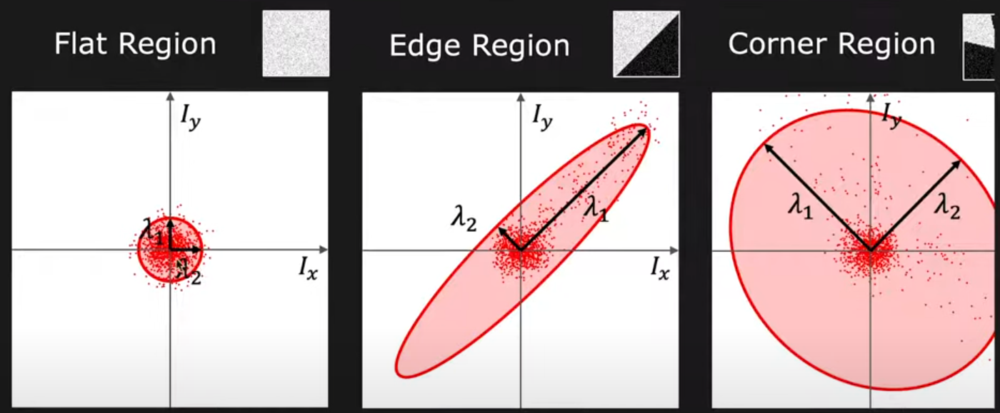
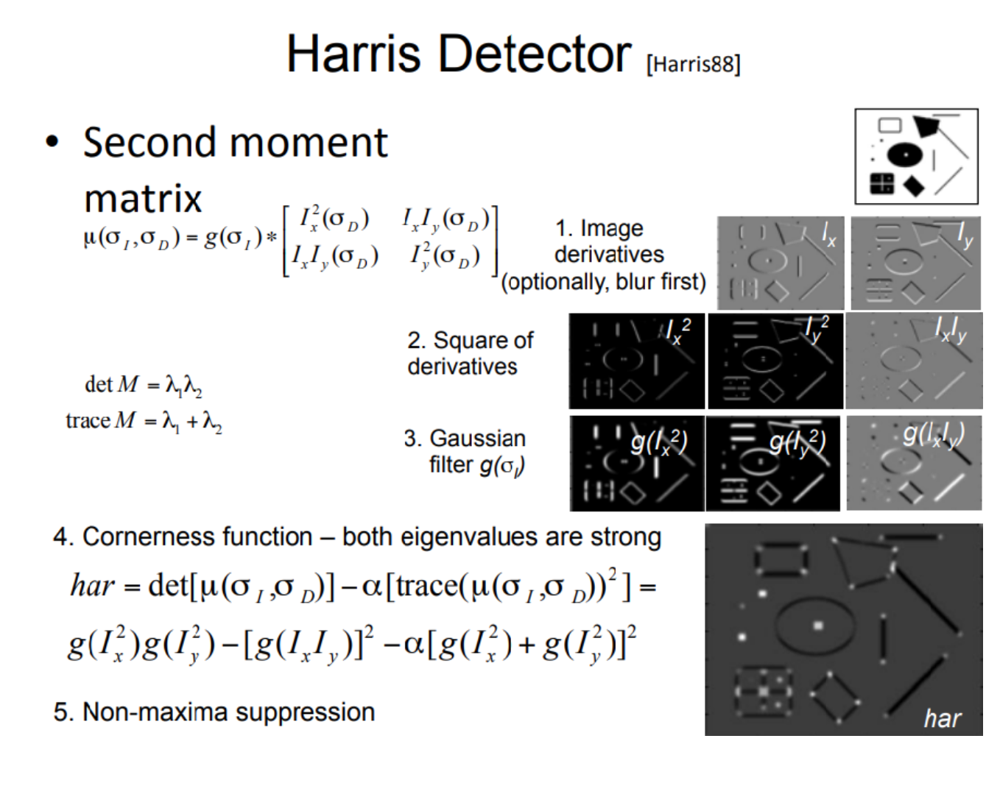

## Harris Corner Detection

reference  
[First Principle of Computer Vision : Edge Detection](https://www.youtube.com/watch?v=Z_HwkG90Yvw&list=PL2zRqk16wsdqXEMpHrc4Qnb5rA1Cylrhx&index=6)  
[Harris Corner Detector Example From Scratch](https://www.kaggle.com/code/dasmehdixtr/harris-corner-detector-example-from-scratch)  

  
  
---
- 위는 이미지의 x,y의 그래디언트를 찾기 위해 Sobel operator를 적용한 dx, dy의 값의 분포도이다.
- 강의에서 람다1과 2는 물체의 중심점(Center of Area)을 지나며, second moment가 최소화 또는 최대화 되는(E_{min} or E{max})로 표현한다. 
- 이 값은 동시에 dx,dy의 covariance matrix의 eigenvalue이기도 하다. 
- Flat한 이미지에서는 람다1과 2 모두 작고 비슷하며, edge가 있는 이미지에서는 람다값들 간의 차이가 크고, corner가 있는 이미지에서는 람다1과 2 모두 크고 비슷하다.
---
- 아래는 corner 값을 구하기 위한 harris response 식이다.

- harris response가 입력된 이미지에 threshold를 적용해 필터한다.
- 코너 주변에는 코너 후보군 클러스터들이 존재하는데, 우리가 원하는 것은 코너당 하나의 좌표이므로, non-maximum suppression을 적용해서 걸러낸다.
